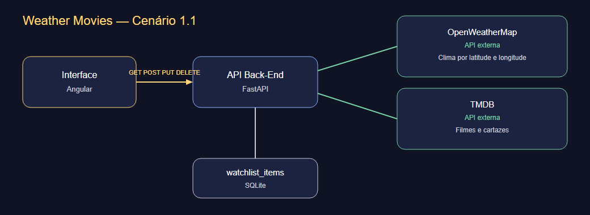

# Weather Movies — Interface

Front-end **Angular 19** + Angular Material. Recomenda filmes com base no clima e gerencia a watchlist falando **somente** com a API própria (`weather-movies-api`). Não há redirect para OpenWeather ou TMDB.

## Telas do protótipo

- **Hoje** (`/`): cidade ou geolocalização, card do clima, gêneros mapeados e grid de filmes. Botão **Salvar na lista** dispara `POST /api/watchlist`.
- **Minha lista** (`/watchlist`): filtro, ordenação, alteração de status/nota (`PUT`) e remoção (`DELETE`).

Se a API estiver offline, as telas abrem em **modo demonstração** com dados de exemplo para o vídeo/protótipo visual.

## Arquitetura



```
Interface (Angular) --REST GET/POST/PUT/DELETE--> API FastAPI
API FastAPI --HTTP--> OpenWeatherMap (API externa: clima por latitude e longitude)
API FastAPI --HTTP--> TMDB (API externa: filmes e cartazes)
API FastAPI --> SQLite (watchlist_items)
```

## APIs externas documentadas

A interface **não** chama a OpenWeatherMap nem a TMDB. Quem consome e trata os dados é a API própria.

### OpenWeatherMap

- Serviço: [OpenWeather Current Weather](https://openweathermap.org/current)
- Licença: uso gratuito com cadastro (Current Weather Data)
- Cadastro da key: https://home.openweathermap.org/users/sign_up
- Rota usada pela API: `GET https://api.openweathermap.org/data/2.5/weather`

### TMDB

- Serviço: [TMDB API](https://developer.themoviedb.org/docs)
- Licença: uso gratuito não comercial, com atribuição à TMDB. Uso comercial exige autorização. Termos: https://www.themoviedb.org/api-terms-of-use
- Cadastro da key: https://www.themoviedb.org/signup e, em seguida, https://www.themoviedb.org/settings/api
- Rota usada pela API: `GET https://api.themoviedb.org/3/discover/movie`
- Cartazes: `https://image.tmdb.org/t/p/w500/{poster_path}`

## Início rápido

Na pasta `weather-movies-web` (Node 18+ / 20 recomendado):

```bash
npm install
npm start
```

Ou `start.bat` no Windows. Abre http://127.0.0.1:4200

O `ng serve` faz proxy de `/api` para `http://127.0.0.1:8000`. Suba a API antes para dados reais.

## Docker Compose

Os dois repositórios devem ficar lado a lado (`weather-movies-web` e `weather-movies-api`). As chaves da entrega já estão na API. Nesta pasta:

```bash
docker compose up --build
```

- Front: http://127.0.0.1:4200
- Swagger da API: http://127.0.0.1:8000/swagger

## Dockerfile isolado

```bash
npm run build
docker build -t weather-movies-web .
docker run --rm -p 4200:80 weather-movies-web
```

## Estrutura

```
src/app/core/     HttpClient da API, toasts, modelos
src/app/pages/    telas Hoje e Minha lista
public/           architecture.png (diagrama obrigatório)
```
